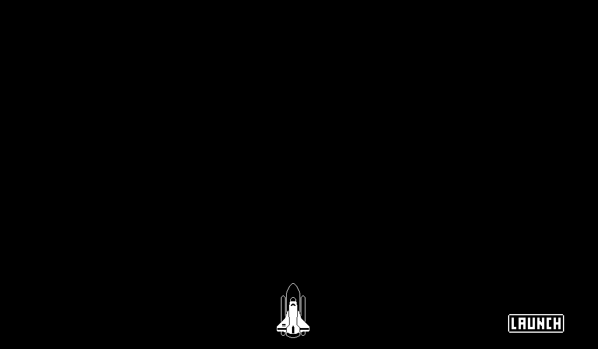

# Rocket Launch

## The 1-bit Godot Course - by Heartbeast

## Intuito deste estudo:
Ao apertar o botão "LAUNCH" (TextureButton), o foguete será lançado mudando de "Sprite".
Assim que o foguete sair da tela, um campo será chamado adicionando um tempo de 2 segundos. Logo após, o botão "RESET" (TextureButton) irá surgir. 
Na animação do lançamento, foi utilizado "AnimationPlayer". 
O World (Node) foi utilizado como nó principal. Seguido por Node ColorRect, acrescentando a cor no background.

~~Suricato Safado~~ 👾

